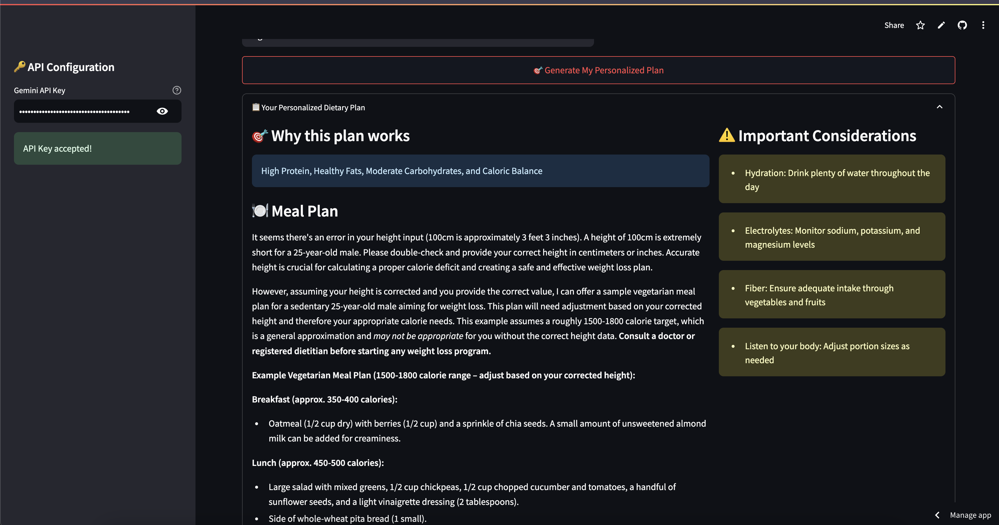

# AI Health & Fitness Planner Agent 🏋️‍♂️

The **AI Health & Fitness Planner** is a personalized health and fitness Agent powered by Agno AI Agent framework. This app generates tailored dietary and fitness plans based on user inputs such as age, weight, height, activity level, dietary preferences, and fitness goals.

## Live Demo

Experience the application: [AI Design Agent Team](https://ai-real-estate-agent.streamlit.app/)

## Application Screenshot



## Features

- **Health Agent and Fitness Agent**

  - The app has two phidata agents that are specialists in giving Diet advice and Fitness/workout advice respectively.

- **Personalized Dietary Plans**:

  - Generates detailed meal plans (breakfast, lunch, dinner, and snacks).
  - Includes important considerations like hydration, electrolytes, and fiber intake.
  - Supports various dietary preferences like Keto, Vegetarian, Low Carb, etc.

- **Personalized Fitness Plans**:

  - Provides customized exercise routines based on fitness goals.
  - Covers warm-ups, main workouts, and cool-downs.
  - Includes actionable fitness tips and progress tracking advice.

- **Interactive Q&A**: Allows users to ask follow-up questions about their plans.

## Requirements

The application requires the following Python libraries:

- `agno`
- `google-generativeai`
- `streamlit`

Ensure these dependencies are installed via the `requirements.txt` file according to their mentioned versions

## How to Run

Follow the steps below to set up and run the application:
Before anything else, Please get a free Gemini API Key provided by Google AI here: https://aistudio.google.com/apikey

### How to Get Started

### 1. **Setup Environment**

```bash
# Clone the repository
# Create and activate virtual environment (optional)
python -m venv venv
source venv/bin/activate  # On Windows: venv\Scripts\activate

# Install dependencies
pip install -r requirements.txt
```

2. **Run the Streamlit app**
   ```bash
   streamlit run app.py
   ```
