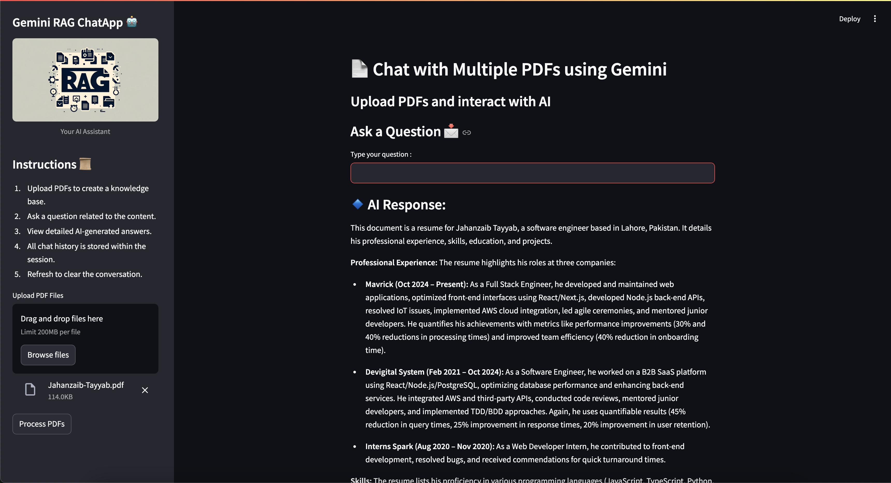

# Chat with Multiple PDFs using RAG & Gemini

## Introduction

The **Chat with PDF using the Gemini** application is a powerful AI-driven tool that enhances document interactions using **Retrieval-Augmented Generation (RAG)**. By integrating FAISS for efficient semantic search and Google Gemini LLM for intelligent responses, this application allows users to upload multiple PDF files and engage in meaningful, context-aware conversations. This approach enhances document analysis, making it ideal for research, business reports, and technical documentation.

## Features

- Upload multiple PDF files.
- Extract and process text from uploaded documents.
- Session-based chat history for continuous interaction.
- Ask context-specific questions and get detailed answers.
- Uses Gemini LLM for high-quality, accurate responses.
- Provides a user-friendly Streamlit interface.

## Live Demo

Experience the application: [AI Design Agent Team](https://pdfchat-app-rag-jahanzaib.streamlit.app/)

## Application Screenshot



## Setup Instructions

### 1. Create a Virtual Environment

To ensure all dependencies are isolated and the environment is consistent, create a virtual environment using Conda:

**Setup Environment**

```bash
# Clone the repository
# Create and activate virtual environment (optional)
python -m venv venv
source venv/bin/activate  # On Windows: venv\Scripts\activate

# Install dependencies
pip install -r requirements.txt
```

### 3. Set Up Environment Variables

- Create a `.env` file in the project directory.
- Add your Google API key in the following format:
- `GOOGLE_API_KEY= "your_google_api_key_here"`

## Tools and Technologies Used

- **Programming Language:** Python 3.12.8
- **Framework:** Streamlit, Langchain
- **RAG (Retrieval-Augmented Generation)**
- **Vector Database:** FAISS (Facebook AI Similarity Search).
- **Embeddings Model** models/embedding-001
- **LLM (AI Model):** Google Gemini
- **Libraries:**
  - `dotenv` for environment variable management
  - `PyPDF2` to read and extract data from PDF's
  - `google-generativeai` for AI capabilities

## How to Run

- Open terminal in VS Code and run the command:
  ```sh
  streamlit run app.py
  ```
